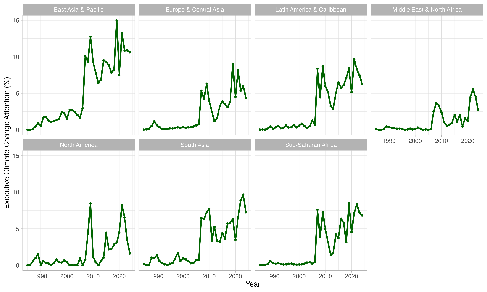

# Executive Climate Change Attention

Repository for the construction of the Executive Climate Change Attention indicator introduced in the [paper](https://doi.org/10.1162/glep.a.1), "Executive Climate Change Attention: Toward an Indicator of Comparative Climate Change Attention," published in *Global Environmental Politics*. The indicator, available in the `data` folder, tracks the salience of climate change in executive speeches at the United Nations General Assembly (UNGA) and measured through the fine-tuning of a transformer model. It covers 195 countries from 1980 to 2024.



**Model**

The model used to generate the indicator is a fine-tuned version of [`deberta-v3-base`](https://huggingface.co/microsoft/deberta-v3-base)
, designed to classify UNGA speeches as either "climate change" or "not climate change." This classification is based on a sample of approximately 5,000 UNGA sentences annotated by the authors to identify explicit references to climate change. The model is available for inference on [HuggingFace](https://huggingface.co/mljn/unga-climate-classifier). More information of the model training can be found in the supplementary material of the paper.

**Citation**

Emiliano Grossman, Malo Jan; Executive Climate Change Attention: Toward an Indicator of Comparative Climate Change Attention. Global Environmental Politics 2025; doi: https://doi-org.scpo.idm.oclc.org/10.1162/glep.a.1

```{bibtex}
@article{grossman2025executive,
  title={Executive Climate Change Attention: Toward an Indicator of Comparative Climate Change Attention},
  author={Grossman, Emiliano and Jan, Malo},
  journal={Global Environmental Politics},
  pages={1--14},
  year={2025},
  publisher={MIT Press 255 Main Street, 9th Floor, Cambridge, Massachusetts 02142, USA~…}
}
```


